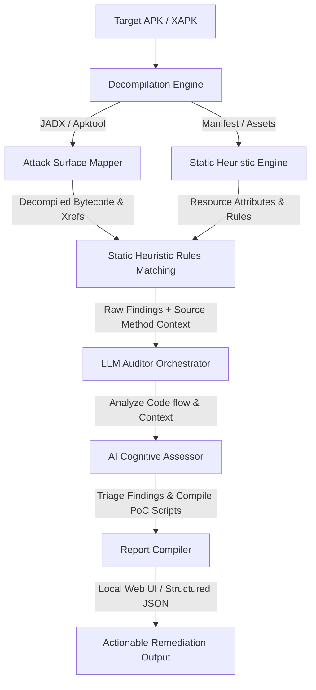

# 🐊 APPredator

<p align="center">
  
</p>

<p align="center">
  <strong>Advanced Android Static Analysis & Intelligent LLM-Assisted Vulnerability Auditing</strong>
</p>

<p align="center">
  
  
  
  
</p>

<p align="center">
  <a href="#-core-philosophy">Core Philosophy</a> &bull;
  <a href="#-features">Features</a> &bull;
  <a href="#-architecture--workflow">Architecture</a> &bull;
  <a href="#-detection-capabilities">Detection Scope</a> &bull;
  <a href="#-getting-started">Getting Started</a> &bull;
  <a href="#-advanced-configuration">Configuration</a> &bull;
  <a href="#-cli-reference">CLI Reference</a> &bull;
  <a href="#-docker-deployment">Docker</a> &bull;
  <a href="#-troubleshooting">Troubleshooting</a>
</p>

---

## 🎯 Core Philosophy

Traditional static analysis tools (SAST) for Android apps generate hundreds of findings, drowning security researchers and developers in **false positives**. They flag risky API calls but lack the semantic understanding to determine if a vulnerability is truly exploitable under the target application's unique business logic.

**APPredator** bridges this gap. It combines **high-performance local decompilation engines** (JADX & Apktool) with **cognitive Large Language Models (LLMs)**. By feeding target method bytecode, resource manifests, and attack-surface call-graphs into state-of-the-art LLMs, APPredator automatically separates real security threats from safe usages, documents impact, and drafts ready-to-run Proof of Concept (PoC) exploit scripts.

---

## ⚡ Key Features

* 💻 **Dual-Mode Execution (CLI & Local Web UI)**: Utilize a fast, scriptable Command Line Interface for automated CI/CD pipelines, alongside an interactive, premium Local React-based Web GUI for manual analysis.
* 🧠 **Cognitive AI Auditing**: Connects natively to cloud-based LLM providers (Google Gemini, OpenAI GPT, Anthropic Claude, DeepSeek, OpenRouter, Groq) or local instances (Ollama) to perform reasoning, false-positive elimination, and exploit generation.
* 🔍 **Call-Graph Cross-Referencing (Xref)**: Maps application entry points, follows execution tracks, and injects complete cross-reference context into LLM prompts for unparalleled context awareness.
* 🔒 **Local-First & Privacy Compliant**: Designed for enterprise pentesting. Decompilation, heuristics parsing, and static analysis execute 100% locally. No proprietary source code or binaries are sent to third parties.
* 🐳 **Zero-Config Docker Orchestration**: A fully containerized multi-stage setup builds the entire React frontend and compiles the Java/Python runtime seamlessly with a single terminal command.

---

## 🎨 Architecture & Workflow

APPredator processes target packages in a secure, pipeline-oriented fashion:



---

## 🛡️ Detection Scope

APPredator matches static signatures across an expansive array of built-in security rules:

| Rule Identifier | Security Area | Threat Description |
| :--- | :--- | :--- |
| `biometric_bypass` | Cryptography & Auth | Insecure implementation of biometric confirmation prompts allowing authentication bypass. |
| `deeplink_hijack` | IPC Security | Exposed intent filters vulnerable to Deep Link interception and data harvesting. |
| `deeplink_logic_bypass` | Business Logic | Improper authentication or state validation inside custom deep-link target handlers. |
| `exported_components` | Attack Surface | Unprotected activities, services, or broadcast receivers exposed to malicious packages. |
| `fragment_injection` | Code Execution | Vulnerabilities allowing arbitrary fragment loading via unsafe parameter parsing. |
| `graphql_injection` | Web Security | Malicious GraphQL queries compiled dynamically using unsanitized user inputs. |
| `hardcoded_secrets` | Cryptography | Cryptographic keys, API tokens, passwords, or private signing certificates baked in resources. |
| `insecure_deserialization` | Code Execution | Unsafe deserialization of native Java objects (e.g. using `ObjectInputStream`). |
| `insecure_storage` | Data Protection | Saving sensitive data, tokens, or PII into shared preferences or public external storage. |
| `insecure_webview` | Component Security | Unsafe JavaScript execution enabled in local WebViews with broad native interfaces. |
| `intent_spoofing` | IPC Security | Target components launching arbitrary intents forwarded from untrusted third parties. |
| `path_traversal` | File System | Unsanitized inputs used to compute local file paths, enabling directory traversal. |
| `sql_injection` | Data Storage | Raw SQL queries compiled via string concatenation on local SQLite databases. |
| `strandhogg` | UI Security | Task hijacking vulnerabilities enabling task manipulation and phishing attacks. |
| `universal_logic_flaw` | Logic Integrity | Insecure application flow allowing permission checks or authorization logic to be bypassed. |
| `webview_xss` | Web Security | WebViews loading unsanitized remote inputs, opening the door to Cross-Site Scripting. |
| `zip_slip` | File System | Arbitrary file overwrite vulnerabilities during uncompressed archive extraction. |

---

## 🚀 Getting Started

### Host Prerequisites
* **Python**: `3.11` or higher.
* **Java JRE**: `21` or higher (mandatory for running JADX and Apktool locally).
* **Node.js & npm** (optional): Only needed for active frontend development.

### 1. Installation
Clone this repository and install the package locally:

```bash
git clone https://github.com/yourusername/APPredator.git
cd APPredator
pip install -e .
```

### 2. Interactive LLM Initialization
Run the built-in console configuration wizard to configure your preferred LLM provider and API credentials:

```bash
apppredator settings setup
```
This stores your customized settings in [config/settings.yaml](file:///e:/HACKING/APPredator/Dev/config/settings.yaml), which is automatically ignored by Git to prevent API key leaks.

### 3. Run Static Analysis (CLI Mode)
Perform static analysis and AI auditing on an APK:

```bash
apppredator analyze path/to/target.apk --output report.json
```

### 4. Run the Web Interface (Web GUI Mode)
Spin up the local production-grade FastAPI server:

```bash
apppredator web
```
This automatically reconfigures your Windows console to standard **UTF-8**, initializes the Uvicorn engine, and opens your system browser pointing to **`http://127.0.0.1:8765/ui/`** automatically.

---

## 🐳 Docker Deployment

To avoid setting up Java, JADX, or Python packages directly on your host operating system, you can build and launch a fully containerized APPredator setup:

```bash
# Compile dependencies and launch persistent services
docker compose up -d
```
The multi-stage build will build the Vite React app, install system packages, compile the Python runtime, and host the dashboard.
* **Web UI Access**: Visit `http://localhost:8080/ui/` in your browser.
* **Configurations**: Persisted locally inside `./config/settings.yaml`.
* **Output / Reports**: Saved to your local `./output/` directory.

---

## ⚙️ Advanced Configuration

APPredator's behavior is guided by [config/settings.yaml](file:///e:/HACKING/APPredator/Dev/config/settings.yaml). A template of this configuration is provided in [config/settings.yaml.example](file:///e:/HACKING/APPredator/Dev/config/settings.yaml.example).

### LLM Configurations
You can select different providers under the `llm:` key:
```yaml
llm:
  provider: gemini  # ollama | gemini | groq | openai | anthropic | deepseek
  gemini_model: gemini-2.0-flash
  api_key: GEMINI_API_KEY # (or use GEMINI_API_KEY environment variable)
```

### Key Resolution Priorities
To make automation seamless, APPredator resolves API keys in the following order:
1. Configured string value under the provider's `_api_key` key in `config/settings.yaml`.
2. Corresponding environment variable (e.g. `DEEPSEEK_API_KEY`, `OPENAI_API_KEY`, `GEMINI_API_KEY`).

---

## 💻 CLI Reference

APPredator implements a structured commands palette:

| Command Group | Command | Options | Description |
| :--- | :--- | :--- | :--- |
| **Analysis** | `apppredator analyze <APK>` | `--output, -o` / `--generate-exploit` | Runs the SAST + LLM scanner on the target APK. |
| **Web GUI** | `apppredator web` | `--instructions, -i` / `--dev, -d` | Launches the FastAPI production GUI server. |
| **Settings** | `apppredator settings setup` | *None* | Starts the console configuration wizard. |
| **Settings** | `apppredator settings dump` | *None* | Outputs the parsed YAML configuration. |
| **Settings** | `apppredator settings verify` | *None* | Validates the schema of `settings.yaml`. |
| **Settings** | `apppredator settings decompiler` | `apktool \| jadx \| hybrid` | Selects the active decompilation engine. |
| **Profiles** | `apppredator settings profiles list` | *None* | Lists all custom profile presets available. |
| **Rules** | `apppredator rules print` | *None* | Prints every available static matching rule id. |

---

## 📝 Structured JSON Schema Example

When running APPredator in CLI mode with `--output report.json`, the output schema matches this template:

```json
{
  "scan_info": {
    "target": "demo.apk",
    "timestamp": "2026-05-18T17:40:00Z",
    "decompiler": "hybrid",
    "filter_mode": "hybrid"
  },
  "findings": [
    {
      "rule_id": "insecure_storage",
      "severity": "high",
      "component": "com.target.auth.LoginActivity",
      "method": "saveCredentials(String, String)",
      "evidence": "SharedPreferences.Editor.putString(\"passwd\", password)",
      "llm_audit": {
        "is_false_positive": false,
        "impact": "Exposed plain-text user passwords stored inside world-readable local storage directories.",
        "remediation": "Encrypt credentials using Android Keystore System and EncryptedSharedPreferences.",
        "poc_exploit": "cat /data/data/com.target/shared_prefs/auth_prefs.xml"
      }
    }
  ]
}
```

---

## 🔧 Troubleshooting

### 1. Windows Terminal Unicode Crash
If you run `apppredator` on a legacy Windows terminal and experience a `UnicodeEncodeError / charmap` crash:
* **Fix**: APPredator's bootstrapper automatically configures the terminal to **UTF-8** on startup. If you are running via raw Python imports, make sure you execute python with UTF-8 mode enabled: `python -X utf8 -m apppredator.cli web`.

### 2. Decompiler Out-Of-Memory (OOM)
When decompiling massive commercial APKs (e.g. apps over 100MB containing multiple classes.dex files), JADX might run out of memory.
* **Fix**: Increase the maximum JADX heap size in `config/settings.yaml`:
  ```yaml
  jadx:
    max_heap: 10240m # Allocate 10GB of RAM to JADX
  ```

### 3. Docker Compose API Port Binding Conflicts
If you receive a port binding error (`Port 8080 is already allocated`):
* **Fix**: Change the exposed port in your local environment or edit the port mapping inside [docker-compose.yml](file:///e:/HACKING/APPredator/Dev/docker-compose.yml):
  ```yaml
  ports:
    - "9090:8080" # Maps port 9090 on the host to 8080 in the container
  ```

---

## 🔒 License

Distributed under the **MIT License**. See `LICENSE` for more information.

---

<p align="center">
  Created with ❤️ by <strong>Joel Indra</strong> · <a href="https://joelindra.cc">joelindra.cc</a> · <a href="https://hadesxploit.com">hadesxploit.com</a>
</p>
